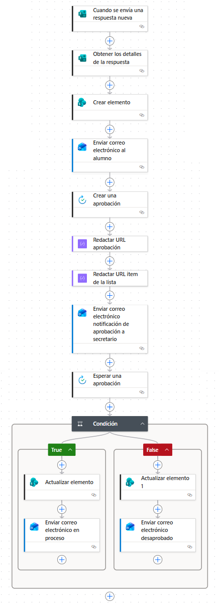
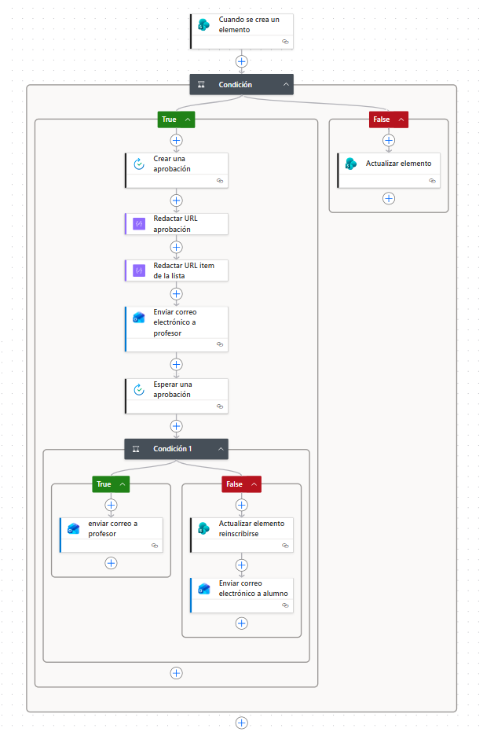
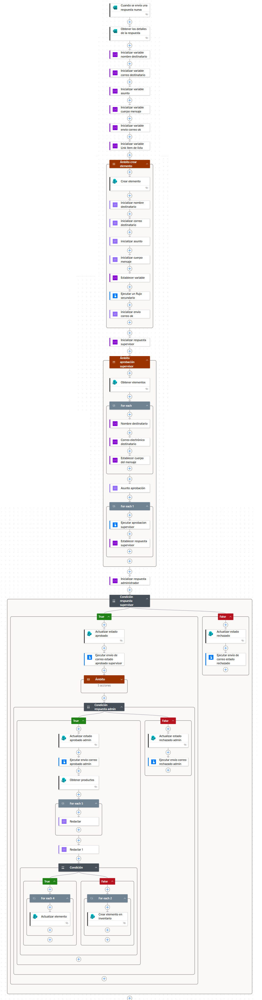

# Microsoft Power Automate

Implementación de soluciones de automatización de procesos utilizando **Microsoft Power Automate**, **Microsoft Forms**, **SharePoint Online** y **Microsoft 365**, aplicando flujos automatizados, procesos de aprobación, notificaciones, validaciones e integración entre servicios para distintos escenarios empresariales.

---

# Descripción

Este repositorio reúne distintas implementaciones desarrolladas con **Microsoft Power Automate**, enfocadas en la automatización de procesos de negocio mediante la integración con **SharePoint Online**, **Microsoft Forms** y **Office 365 Outlook**.

Durante el desarrollo se implementaron flujos automatizados, programados y de aprobación, utilizando diferentes escenarios para automatizar procesos de inscripción, gestión documental, seguimiento de solicitudes, validaciones, notificaciones por correo electrónico y procesos empresariales completos.

---

# Implementaciones realizadas

## Integración con Microsoft Forms

- Registro automático de respuestas.
- Obtención de detalles del formulario.
- Creación automática de elementos en SharePoint.
- Actualización de información desde formularios.

## Integración con SharePoint

- Creación de elementos.
- Actualización automática de registros.
- Consulta de listas.
- Búsqueda de elementos.
- Relaciones entre listas.

## Automatización de correos electrónicos

- Confirmaciones automáticas.
- Notificaciones a responsables.
- Avisos de cambios de estado.
- Recordatorios programados.

## Flujos de aprobación

- Aprobaciones multinivel.
- Aprobaciones mediante Outlook.
- Actualización automática del estado.
- Notificación según resultado de la aprobación.

## Automatización de procesos

- Gestión de inscripciones.
- Registro de incidencias.
- Seguimiento de tesis.
- Gestión de eventos.
- Automatización de procesos empresariales.

## Automatizaciones programadas

- Recordatorios periódicos.
- Verificación automática de estados.
- Seguimiento de procesos pendientes.

## Expresiones y validaciones

- Condiciones.
- Expresiones.
- Operadores lógicos.
- Validaciones de datos.
- Automatización mediante variables.

---

# Tecnologías usadas

---

# Capturas

## Automatización de procesos

---

## Flujos de aprobación

---

## Caso de estudio: TechSupplies

---

# Documentación

La documentación completa del proyecto se encuentra disponible en:

- 📄[Documentación del proyecto](documentacion/Documentacion.md)

---

# Autor

**Andrea Natalia Tello**

- LinkedIn: [Andrea Natalia Tello](https://www.linkedin.com/in/andrea-natalia-tello-623874325/)

---
