# Microsoft Power Automate

# Descripción

Este proyecto reúne distintas implementaciones desarrolladas con **Microsoft Power Automate**, integrando **Microsoft Forms**, **SharePoint Online** y **Microsoft 365** para automatizar procesos empresariales de diferentes niveles de complejidad.

A lo largo de los distintos escenarios se implementaron automatizaciones para registrar información, gestionar aprobaciones, enviar notificaciones, actualizar listas de SharePoint y ejecutar procesos programados, aplicando buenas prácticas en el diseño de flujos y reutilización de componentes.

Las soluciones abarcan desde automatizaciones básicas hasta procesos empresariales con múltiples niveles de aprobación, actualización de inventario y seguimiento de solicitudes.

---

# Objetivos

Durante el desarrollo del proyecto se aplicaron los principales conceptos de Power Automate mediante la implementación de distintos escenarios reales.

Entre los objetivos alcanzados se encuentran:

- Automatizar procesos utilizando Microsoft Forms.
- Integrar Power Automate con SharePoint Online.
- Automatizar el registro de información.
- Implementar flujos de aprobación.
- Automatizar el envío de notificaciones por correo electrónico.
- Ejecutar procesos programados.
- Actualizar información entre listas relacionadas.
- Aplicar validaciones mediante expresiones.
- Modelar procesos empresariales completos.
- Mejorar la eficiencia de procesos repetitivos mediante automatización.

---

# Tecnologías utilizadas

- Microsoft Power Automate
- Microsoft Forms
- Microsoft SharePoint Online
- Microsoft 365
- Office 365 Outlook
- SharePoint Lists
- Approval Actions
- Automated Cloud Flows
- Scheduled Cloud Flows
- Expressions
- Variables
- Condiciones
- Apply to each
- Switch
- Compose

---

# Contenido

- [Arquitectura de las soluciones](#arquitectura-de-las-soluciones)
- [Escenarios implementados](#escenarios-implementados)
- [Gestión de inscripciones universitarias](#gestión-de-inscripciones-universitarias)
- [Registro de incidencias](#registro-de-incidencias)
- [Gestión y seguimiento de tesis](#gestión-y-seguimiento-de-tesis)
- [NASA Space Apps Challenge](#nasa-space-apps-challenge)
- [Caso de estudio — Automatización de inscripciones escolares](#caso-de-estudio--automatización-de-inscripciones-escolares)
- [TechSupplies — Automatización integral de procesos empresariales](#techsupplies--automatización-integral-de-procesos-empresariales)
- [Buenas prácticas aplicadas](#buenas-prácticas-aplicadas)
- [Competencias técnicas desarrolladas](#competencias-técnicas-desarrolladas)
- [Conclusiones](#conclusiones)
- [Autor](#autor)

---

# Arquitectura de las soluciones

Las implementaciones desarrolladas integran distintos servicios de Microsoft 365 para automatizar procesos completos.

La arquitectura general utilizada fue:

**Microsoft Forms**

↓

**Power Automate**

↓

**SharePoint Online**

↓

**Actualización de estados**

↓

**Aprobaciones**

↓

**Notificaciones por correo**

↓

**Procesos programados**

Esta arquitectura se adapta a cada escenario, incorporando únicamente los servicios necesarios según el proceso automatizado.

Dependiendo del escenario, los flujos incluyen diferentes tipos de desencadenadores:

- Cuando se envía un formulario.
- Cuando se crea un elemento.
- Cuando se modifica un elemento.
- Flujos programados.
- Flujos de aprobación.

Asimismo se implementaron automatizaciones para:

- registrar información;
- actualizar registros;
- controlar estados;
- enviar correos electrónicos;
- ejecutar aprobaciones;
- realizar recordatorios automáticos;
- sincronizar información entre distintas listas.

---

# Escenarios implementados

Durante el desarrollo se implementaron los siguientes casos de uso:

- Gestión de inscripciones universitarias.
- Registro de incidencias.
- Gestión y seguimiento de tesis.
- Gestión de inscripciones para eventos.
- Automatización integral de procesos empresariales para TechSupplies.

Cada uno de estos escenarios permitió aplicar distintos tipos de flujos, integraciones y automatizaciones sobre Microsoft Power Platform.

---

# Gestión de inscripciones universitarias

Se desarrolló una solución para automatizar el proceso de inscripción de alumnos mediante la integración de **Microsoft Forms**, **SharePoint Online** y **Power Automate**.

El proceso comienza cuando un estudiante completa un formulario de inscripción. A partir de ese momento, Power Automate registra automáticamente la información en una lista de SharePoint, asigna un estado inicial y ejecuta diferentes automatizaciones según el avance del proceso.

## Funcionalidades implementadas

- Registro automático desde Microsoft Forms.
- Creación de elementos en SharePoint.
- Asignación automática del estado inicial.
- Confirmación de inscripción mediante correo electrónico.
- Notificación a los responsables.
- Recordatorios automáticos mediante flujos programados.

---

## Capturas

### Formulario de inscripción

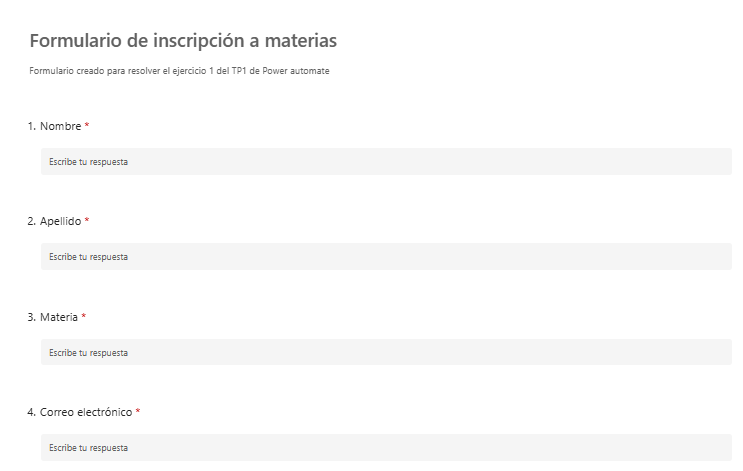

---

### Lista de alumnos

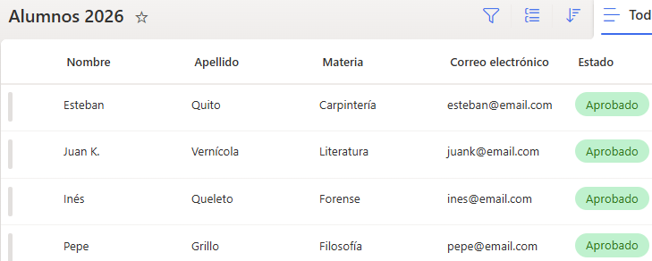

---

### Flujo de registro automático

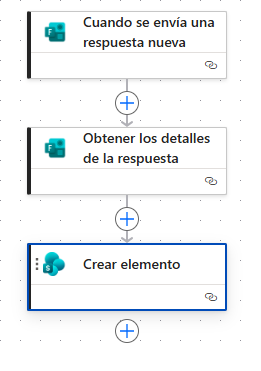

---

### Correo de confirmación

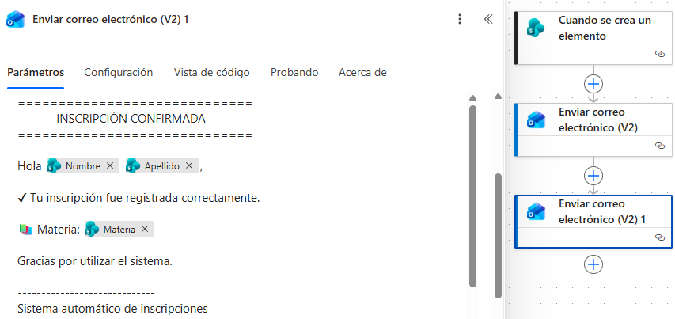

---

### Flujo programado de recordatorios

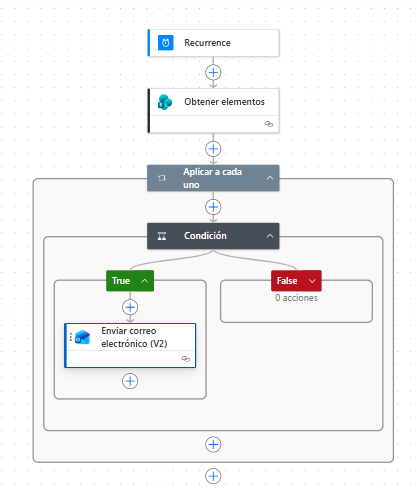

---

# Registro de incidencias

Se implementó un proceso de registro automático de incidencias utilizando Microsoft Forms y SharePoint.

Cada respuesta enviada desde el formulario genera automáticamente un nuevo registro dentro de la lista **Incidencias**, asignando valores por defecto para facilitar el seguimiento posterior.

## Funcionalidades implementadas

- Registro automático desde Microsoft Forms.
- Creación automática de incidencias.
- Asignación del estado inicial.
- Asignación automática del responsable.
- Registro de prioridad.
- Almacenamiento centralizado en SharePoint.

---

## Información almacenada

Cada incidencia registra:

- Nombre del solicitante.
- Descripción del problema.
- Prioridad.
- Fecha del incidente.
- Estado.
- Responsable.
- Respuesta.

---

## Automatizaciones implementadas

Al recibir una nueva respuesta del formulario:

- Se obtienen los datos enviados.
- Se crea automáticamente un elemento en SharePoint.
- Se completa el estado con **"Recibido"**.
- Se asigna **"Indefinido"** como responsable.
- Se inicializa el campo respuesta con **"Sin respuesta"**.

---

## Capturas

### Formulario de registro de incidencias

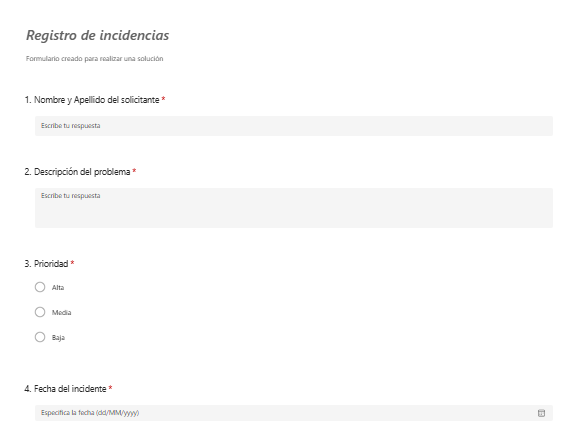

---

### Lista de incidencias

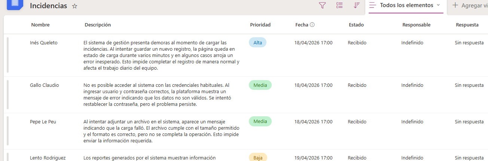

---

### Flujo de automatización

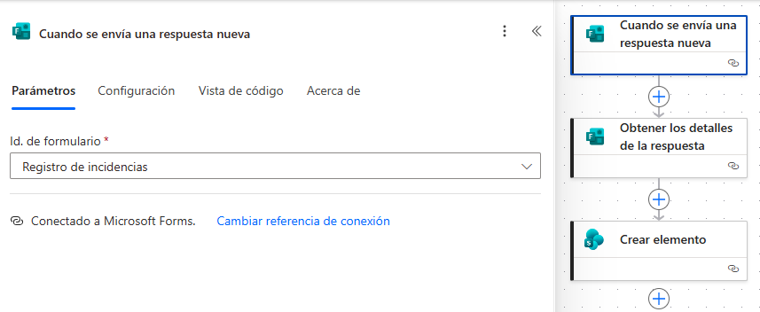

---

# Gestión y seguimiento de tesis

Se desarrolló un proceso completo de automatización para administrar la inscripción y seguimiento de tesis mediante formularios, listas de SharePoint, aprobaciones y notificaciones automáticas.

La solución contempla múltiples etapas, desde la inscripción inicial del alumno hasta la aprobación del proyecto por parte del profesor, incluyendo cambios automáticos de estado y recordatorios programados.

## Etapas implementadas

- Inscripción inicial.
- Registro automático en SharePoint.
- Confirmación al alumno.
- Notificación al secretario.
- Aprobación o rechazo de la inscripción.
- Envío automático del segundo formulario.
- Registro de los datos de la tesis.
- Solicitud de aprobación al profesor.
- Actualización automática del estado.
- Recordatorios diarios según el estado del trámite.

---

## Estados del proceso

Durante el ciclo de vida de la inscripción se utilizan los siguientes estados:

- Inscripto.
- En proceso.
- Desaprobado.
- Pendiente de aprobación.
- En curso.
- Requiere ajustes.

Cada cambio de estado dispara automáticamente los flujos correspondientes.

---

## Automatizaciones implementadas

- Registro automático del alumno.
- Envío de correo de confirmación.
- Solicitud de aprobación al secretario.
- Actualización del estado.
- Envío del segundo formulario.
- Solicitud de aprobación al profesor.
- Notificaciones automáticas.
- Recordatorios programados.

---

## Capturas

### Formulario de inscripción

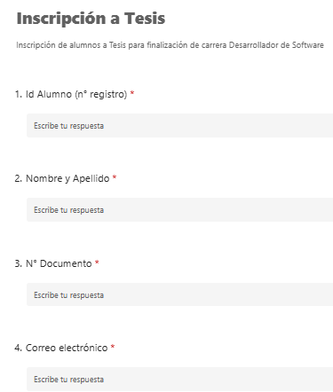

---

### Flujo de inscripción - Aprobación de secretario

---

### Datos de la Tesis - Aprobación de profesor - Correos automáticos

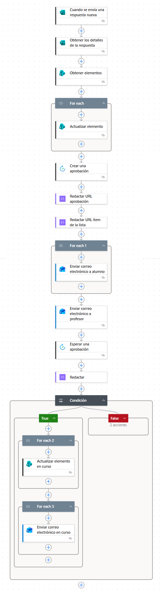

---

### Flujo de recordatorios - Control de estado

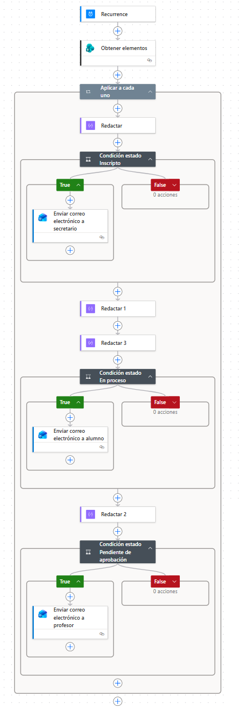

---

# NASA Space Apps Challenge

Se implementó un proceso completo de automatización para administrar las inscripciones de equipos participantes en la competencia **NASA Space Apps Challenge**.

La solución integra Microsoft Forms, SharePoint Online y Power Automate para registrar las inscripciones, validar la información ingresada, gestionar múltiples niveles de aprobación y comunicar automáticamente el estado del proceso a los participantes.

El flujo contempla todas las etapas necesarias hasta determinar si un proyecto se encuentra apto para competir.

---

## Funcionalidades implementadas

- Registro automático desde Microsoft Forms.
- Creación de registros en SharePoint.
- Asignación automática del estado inicial.
- Confirmación de inscripción.
- Validación de datos.
- Aprobación por parte del coordinador de la carrera.
- Evaluación del proyecto por el profesor coordinador.
- Actualización automática del estado.
- Notificaciones automáticas al estudiante.

---

## Estados del proceso

Durante el flujo se utilizan los siguientes estados:

- Revisión de condiciones.
- Datos correctos.
- Incompleto.
- Apto para competir.
- Modificar proyecto.

Cada cambio de estado activa automáticamente el siguiente proceso correspondiente.

---

## Automatizaciones implementadas

El proceso incluye las siguientes automatizaciones:

- Registro del formulario.
- Creación del elemento en SharePoint.
- Confirmación al alumno.
- Solicitud de aprobación al coordinador.
- Verificación de información obligatoria.
- Actualización automática del estado.
- Solicitud de evaluación al profesor.
- Notificación del resultado final.

---

## Capturas

### Formulario de inscripción

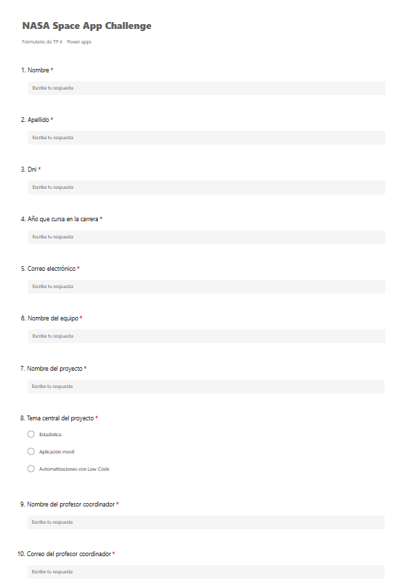

---

### Lista Challenge NASA

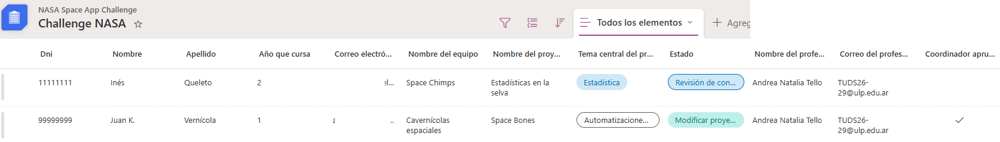

---

### Flujo de registro - Correo de confirmación

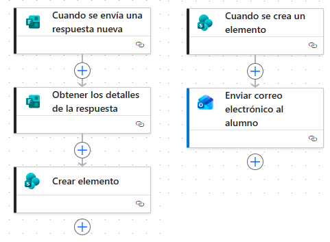

---

### Flujo de aprobación del coordinador

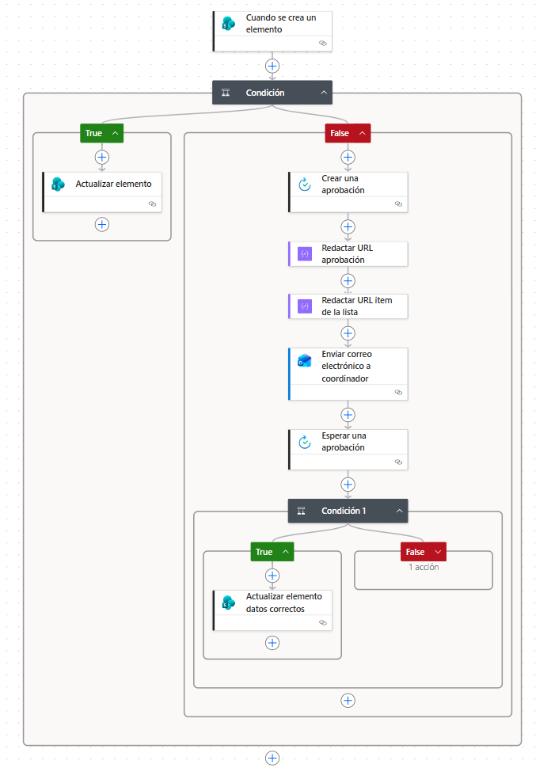

---

### Flujo de evaluación del profesor - Notificación por correo

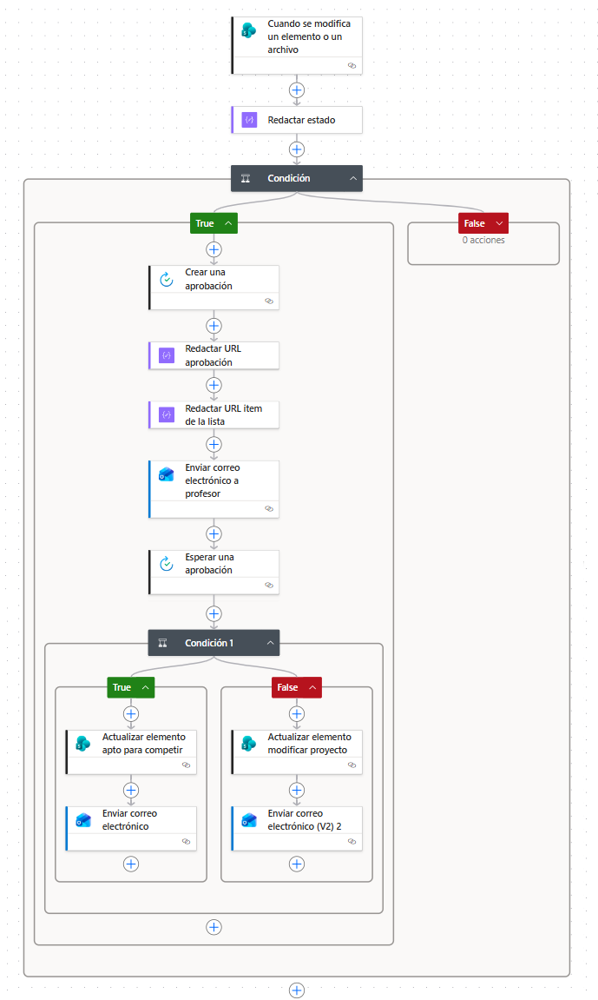

---

# Caso de estudio — Automatización de inscripciones escolares

Se desarrolló un escenario completo para automatizar el proceso de inscripción de estudiantes a un evento escolar utilizando Microsoft Forms, SharePoint Online y Power Automate.

La solución contempla tanto el registro inicial del alumno como la validación de los datos por parte del profesor coordinador y el registro automático de los participantes aprobados.

Además, incorpora recordatorios periódicos para evitar solicitudes pendientes.

---

## Funcionalidades implementadas

- Registro de inscripción.
- Confirmación automática por correo.
- Aprobación del profesor.
- Reinscripción cuando corresponde.
- Registro automático de participantes aprobados.
- Recordatorios automáticos.
- Validaciones mediante expresiones.

---

## Estados implementados

El proceso utiliza los siguientes estados:

- Inscripto.
- Reinscribirse.
- Aprobado.

Cada estado determina automáticamente las acciones que debe ejecutar el flujo correspondiente.

---

## Validaciones implementadas

Se aplicaron expresiones para validar automáticamente:

- DNI.
- Nombre.
- Apellido.
- Año que cursa.
- Correo electrónico.
- Profesor coordinador.

Estas validaciones permiten detectar datos incompletos o inválidos antes de continuar con el proceso.

---

## Automatizaciones implementadas

- Registro automático desde Forms.
- Creación de elementos en SharePoint.
- Confirmación al alumno.
- Solicitud de aprobación.
- Actualización del estado.
- Registro de participantes aprobados.
- Recordatorios programados.

---

## Capturas

### Formulario de inscripción

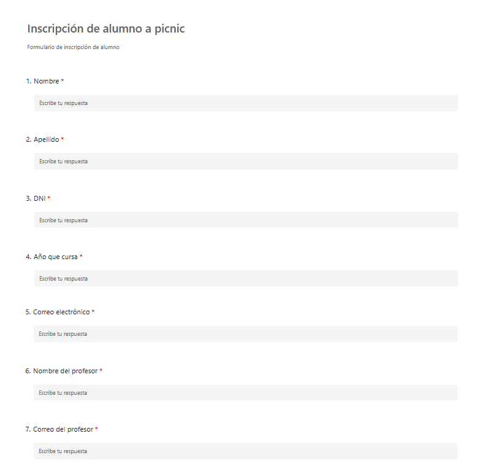

---

### Formulario del profesor

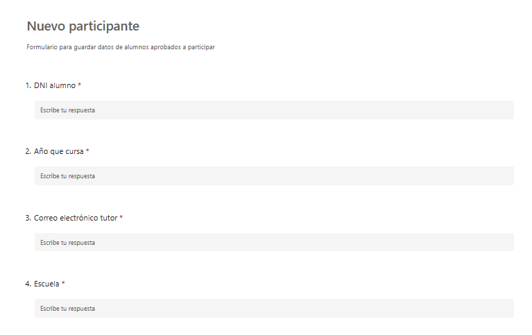

---

### Lista FELIZ DÍA

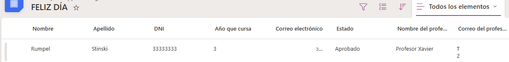

---

### Lista Espacio Libre

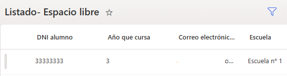

---

### Flujo de aprobación

---

### Recordatorios automáticos

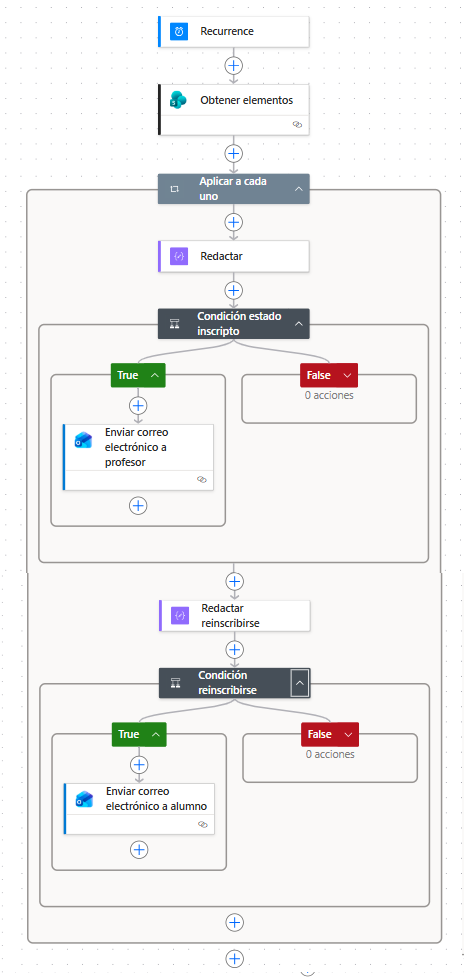

---

Las implementaciones desarrolladas permitieron incorporar progresivamente las principales capacidades de Microsoft Power Automate, incluyendo automatización mediante Microsoft Forms, integración con SharePoint Online, flujos de aprobación, notificaciones por correo y procesos programados.
Como cierre del recorrido, todos estos conocimientos convergen en el proyecto integrador **TechSupplies**, donde se implementa una solución empresarial completa basada en procesos automatizados e integraciones entre distintos servicios de Microsoft 365.

---

# TechSupplies — Automatización integral de procesos empresariales

TechSupplies constituye el proyecto integrador del repositorio y reúne en una única solución los conceptos desarrollados en los trabajos prácticos anteriores.

La implementación integra Microsoft Forms, SharePoint Online y Power Automate para administrar solicitudes de compra, inventario y ventas mediante procesos automatizados, múltiples niveles de aprobación y componentes reutilizables.

Representa la implementación de mayor complejidad del repositorio, integrando múltiples procesos empresariales automatizados mediante Microsoft Power Platform.
---

## Procesos implementados

La solución se divide en tres procesos principales que funcionan de manera integrada.

- Solicitudes de compra.
- Gestión de inventario.
- Ventas y seguimiento de pedidos.

Cada proceso utiliza listas de SharePoint, formularios, aprobaciones y notificaciones automáticas para reducir tareas manuales y mejorar el seguimiento de cada operación.

---

# Solicitudes de compra

Se implementó un flujo de aprobación multinivel para gestionar las solicitudes de compra realizadas por el área de Ventas.

El proceso comienza cuando un empleado completa un formulario solicitando la compra de un insumo. La información se registra automáticamente en SharePoint y comienza un circuito de aprobaciones.

## Funcionalidades implementadas

- Registro automático desde Microsoft Forms.
- Creación de solicitudes en SharePoint.
- Aprobación del supervisor.
- Aprobación del área administrativa.
- Actualización automática del estado.
- Notificaciones por correo en cada etapa.
- Reutilización de flujos hijos para envío de correos y aprobaciones.

## Estados implementados

- Pendiente.
- Aprobado por supervisor.
- Rechazado por supervisor.
- Aprobado.
- Rechazado.

## Automatizaciones implementadas

- Registro automático.
- Solicitud de aprobación al supervisor.
- Solicitud de aprobación al administrador.
- Actualización automática del estado.
- Correos automáticos para el solicitante.
- Correos automáticos para los responsables.

---

## Capturas

### Formulario de solicitud de compra

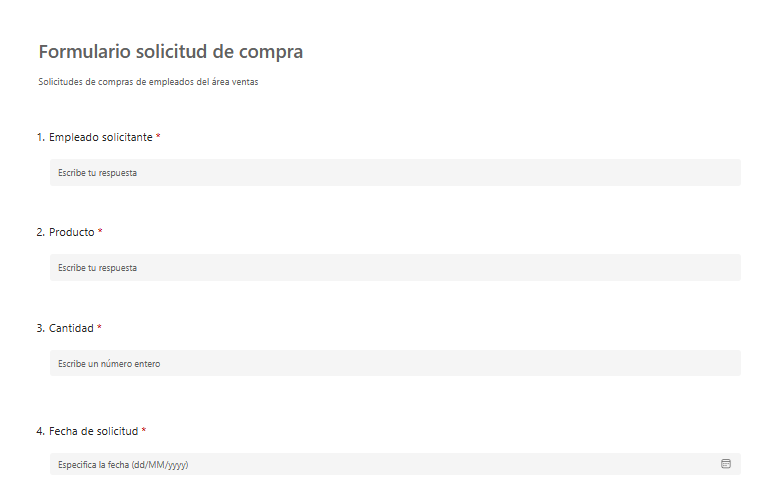

---

### Lista Solicitudes de compra

---

### Flujo principal de solicitudes de compra

---

### Flujo hijo de aprobaciones

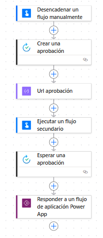

---

### Flujo hijo de correos

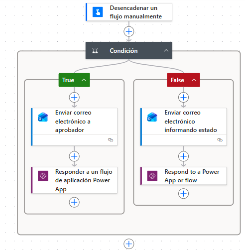

---

# Gestión de inventario

Se implementó un proceso automático para controlar el inventario disponible y generar alertas cuando el stock alcanza valores críticos.

Cada modificación del inventario es evaluada automáticamente para determinar si corresponde enviar una notificación a los responsables.

Además, se implementó un mecanismo para evitar el envío repetitivo de correos durante el mismo día utilizando una columna de control.

## Funcionalidades implementadas

- Actualización automática del inventario.
- Control de stock mínimo.
- Envío de alertas.
- Prevención de correos duplicados.
- Registro de la última alerta enviada.

## Automatizaciones implementadas

- Detección automática de stock mínimo.
- Consulta de fecha de última alerta.
- Envío de correo al encargado de almacén.
- Envío de correo al supervisor de ventas.

---

## Capturas

### Lista de Inventario

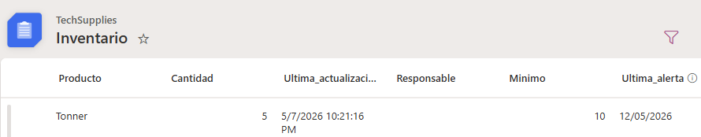

---

### Flujo de control de stock

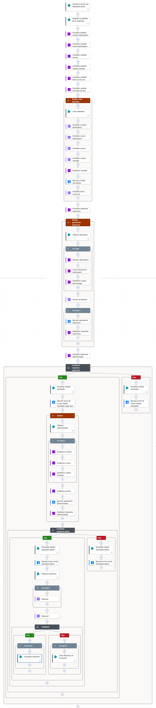

---

### Correo de alerta

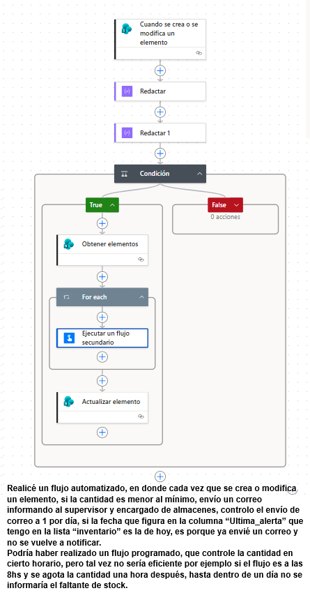

---

# Ventas y seguimiento de pedidos

Se desarrolló un proceso completo para administrar pedidos de clientes mediante múltiples niveles de aprobación y actualización automática del inventario.

El flujo comienza cuando un cliente realiza un pedido y finaliza con la actualización de las listas de Inventario y Ventas una vez despachado el producto.

## Funcionalidades implementadas

- Registro automático del pedido.
- Aprobación por responsable de ventas.
- Validación por el sector Deudores.
- Notificación al sector Embalaje.
- Actualización automática del inventario.
- Registro automático de ventas.
- Prevención de actualizaciones duplicadas mediante bandera de control.

## Estados implementados

- Pendiente.
- Aprobado por ventas.
- Rechazado por ventas.
- Compra autorizada.
- No autorizado.
- Enviado.

## Automatizaciones implementadas

- Registro del pedido.
- Aprobación del responsable de ventas.
- Aprobación del sector Deudores.
- Actualización del estado.
- Notificación al área de Embalaje.
- Descuento automático del stock.
- Registro automático de la venta.
- Actualización mediante bandera de control para evitar duplicaciones.

---

## Capturas

### Formulario de pedido

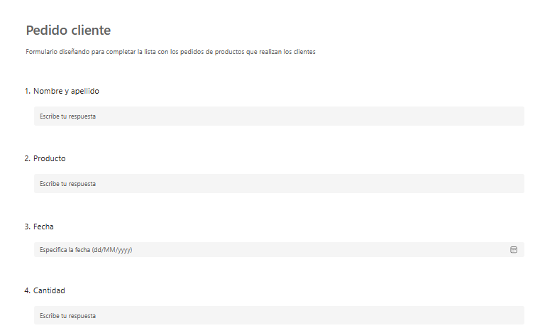

---

### Lista de Pedidos

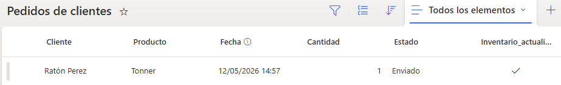

---

### Flujo de ventas

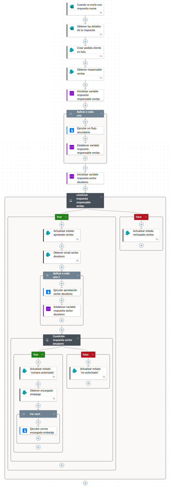

---

### Flujo de actualización de inventario

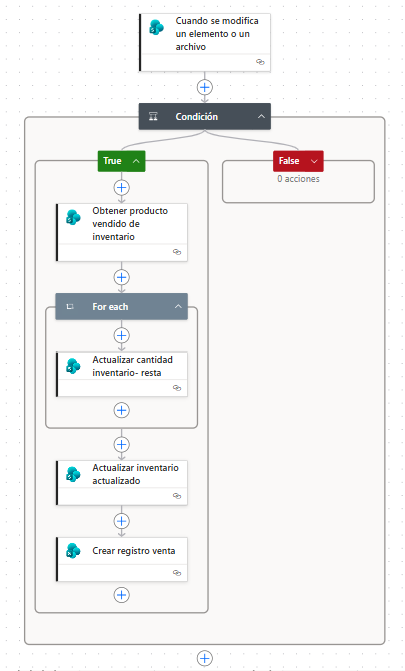

---

### Correos automáticos

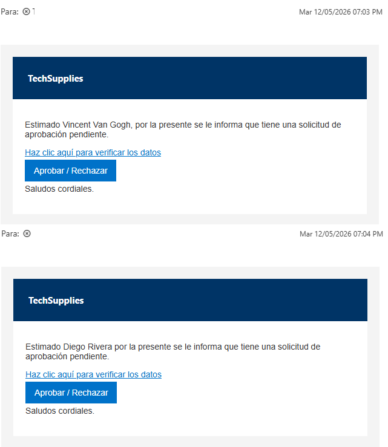

---

# Buenas prácticas aplicadas

Durante el desarrollo de las automatizaciones se aplicaron distintas estrategias para mejorar la organización de los flujos, facilitar su mantenimiento y evitar comportamientos no deseados.

## Reutilización mediante Child Flows

Se implementaron flujos hijo para centralizar procesos reutilizables, principalmente el envío de correos electrónicos y las aprobaciones.

Esta arquitectura permitió desacoplar funcionalidades comunes del flujo principal, facilitando la escalabilidad y reutilización de los componentes.

Esta estrategia permitió:

- Reducir la duplicación de acciones.
- Simplificar los flujos principales.
- Facilitar el mantenimiento de las automatizaciones.
- Reutilizar la misma lógica en distintos procesos.

---

## Control de ejecuciones mediante banderas

En los procesos que actualizan listas relacionadas se utilizaron columnas de control para evitar que una misma automatización se ejecutara más de una vez sobre el mismo registro.

Esta técnica fue aplicada principalmente en la actualización del inventario y el registro de ventas del proyecto TechSupplies.

---

## Validación de datos

Se utilizaron expresiones de Power Automate para validar información ingresada por los usuarios antes de continuar con determinadas automatizaciones.

Entre las validaciones implementadas se encuentran:

- DNI.
- Nombre y apellido.
- Correo electrónico.
- Año de cursado.
- Campos obligatorios.

Estas validaciones permiten reducir errores y mejorar la calidad de la información almacenada.

---

## Gestión de estados

Todos los procesos fueron modelados mediante estados almacenados en listas de SharePoint.

Cada cambio de estado determina automáticamente las acciones que debe ejecutar Power Automate, permitiendo construir flujos secuenciales con múltiples etapas de aprobación, notificación y seguimiento.

---

# Tecnologías y competencias aplicadas

El desarrollo de estas implementaciones permitió profundizar en las capacidades de Microsoft Power Automate para automatizar procesos empresariales mediante la integración con otros servicios de Microsoft 365.

Entre los principales conceptos aplicados se destacan:

- Diseño de flujos automatizados.
- Flujos programados.
- Flujos de aprobación.
- Integración con Microsoft Forms.
- Integración con SharePoint Online.
- Integración con Outlook.
- Actualización de listas mediante SharePoint.
- Gestión de estados.
- Automatización de procesos empresariales.
- Uso de expresiones.
- Variables.
- Condiciones.
- Bucles.
- Acciones de aprobación.
- Envío automático de correos.
- Reutilización de componentes mediante flujos hijos.
- Prevención de ejecuciones duplicadas mediante banderas de control.
- Automatización de procesos de negocio utilizando Microsoft Power Platform.

---

# Conclusiones

Las implementaciones desarrolladas permitieron aplicar las principales capacidades de Microsoft Power Automate para automatizar procesos de negocio mediante la integración con Microsoft Forms, SharePoint Online y Outlook.

A lo largo de los distintos escenarios se implementaron procesos de registro automático, aprobaciones multinivel, notificaciones por correo, actualización de listas de SharePoint, validaciones de datos, recordatorios programados y sincronización entre múltiples servicios de Microsoft 365.

El proyecto integrador **TechSupplies** permitió consolidar todos los conceptos desarrollados a lo largo de los distintos proyectos, implementando una solución empresarial que automatiza procesos de compras, inventario y ventas mediante flujos reutilizables, múltiples niveles de aprobación y actualización automática de la información.

La experiencia permitió consolidar conocimientos sobre automatización de procesos empresariales, integración de servicios de Microsoft 365 y diseño de soluciones escalables basadas en Microsoft Power Platform, aplicando criterios de reutilización, mantenimiento y optimización propios de entornos productivos.

---

# Autor

**Andrea Natalia Tello**

- LinkedIn: [Andrea Natalia Tello](https://www.linkedin.com/in/andrea-natalia-tello-623874325/)
